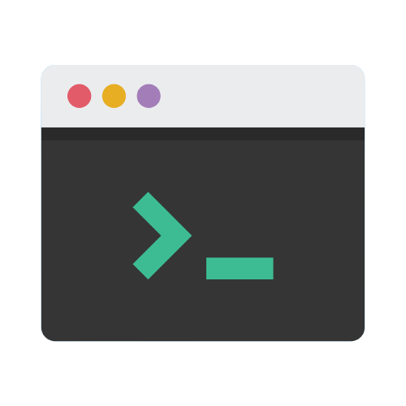

<a name="readme-top"></a>

  <!-- PROJECT SHIELDS -->

[![Contributors][contributors-shield]][contributors-url]
[![Forks][forks-shield]][forks-url]
[![Stargazers][stars-shield]][stars-url]
[![Issues][issues-shield]][issues-url]
[![MIT License][license-shield]][license-url]
[![LinkedIn][linkedin-shield]][linkedin-url]

  <!-- PROJECT LOGO -->

  <br />
  <div align="center">
    <a href="https://github.com/mdyeates/readme-generator">
      
    </a>
    <h3 align="center">Professional README Generator</h3>
    <p align="center">
    <br/>
    Simplify the documentation process for your projects by effortlessly creating high-quality and informative README.md files
    <br/>
      <br/>
      Professional README Generator is proudly built by: Michael Yeates
      <br/>
      <br/>
      <a href="https://github.com/mdyeates/readme-generator"><strong>Explore the docs »</strong></a>
      <br/>
      <br/>
      <a href="https://mdyeates.github.io/readme-generator/">View Live Website</a>
      ·
      <a href="https://github.com/mdyeates/readme-generator/issues">Report Bug</a>
      ·
      <a href="https://github.com/mdyeates/readme-generator/issues">Request Feature</a>
    </p>
  </div>
  
  <!-- TABLE OF CONTENTS -->

  <details>
    <summary>Table of Contents</summary>
    <ol>
      <li>
        <a href="#about-the-project">About The Project</a>
        <ul>
          <li><a href="#screenshot">Screenshot</a></li>
          <li><a href="#built-with">Built With</a></li>
          <li><a href="#description">Description</a></li>
        </ul>
      </li>
      <li>
          <a href="#getting-started">Getting Started</a>
        <ul>
          <li><a href="#prerequisites">Prerequisites</a></li>
          <li><a href="#installation">Installation</a></li>
        </ul>
      </li>
      <li>
          <a href="#usage">Usage</a>
        <ul>
          <li><a href="#functionality">Functionality</a></li>
    <!-- <li><a href="#mobile-responsive">Mobile Responsive</a></li> -->
        </ul>
      </li>
      <li><a href="#license">License</a></li>
      <li><a href="#contributing">Contributing</a></li>
      <li><a href="#tests">Tests</a></li>
      <li><a href="#questions">Questions</a></li>
      <li><a href="#acknowledgments">Acknowledgments</a></li>
    </ol>
  </details>
  
  <!-- ABOUT THE PROJECT -->
  
  ## About The Project
  
  ### Screenshot
  
  [![Professional README Generator Screen Shot][product-screenshot]](https://mdyeates.github.io/readme-generator/)
  
  <p align="right"><a href="#readme-top">back to top</a></p>
  
  ### Built With
  
  - 

- 

  <p align="right"><a href="#readme-top">back to top</a></p>

  ### Description

  It has never been easier to document your repository projects than with this command-line application built using Node.js. Simply provide information about your project and let it do the rest. The generated README file includes sections for the project title, description, a table of contents, installation, usage, license, contributing, tests and questions. Additionally, the user can also select a license from a list of options, which will add a badge near the top of the README file and include a reference in the license section. The user's GitHub username and email address are also added to the questions section. For easy navigation, the table of contents includes links that take users to the relevant sections.

  <p align="right"><a href="#readme-top">back to top</a></p>

<!-- GETTING STARTED -->

## Getting Started

To get a local copy up and running follow these simple example steps.

### Prerequisites

- npm
  ```sh
  npm install npm@latest -g
  ```

### Installation

1. Clone the repo
   ```sh
   git clone https://github.com/mdyeates/readme-generator.git
   ```
2. Install NPM packages
   ```sh
   npm install
   ```

  <p align="right"><a href="#readme-top">back to top</a></p>
  
  <!-- USAGE EXAMPLES -->
  
  ## Usage
  
  ### Functionality
  
  - The following video demonstrates the applications functionality
  
    [![Functionality Video][functionality-video]](https://mdyeates.github.io/readme-generator/)

  <p align="right"><a href="#readme-top">back to top</a></p>
  
  <!--### Mobile Responsive
  
  - As demonstrated in the screenshot below, this application is designed to be responsive and adjust seamlessly to fit various screen sizes
  
    [![Responsiveness Screenshot][responsive-screenshot]](https://mdyeates.github.io/readme-generator/)
  
  <p align="right"><a href="#readme-top">back to top</a></p> -->

  <!-- LICENSE -->

## License

Distributed under the MIT License. See `LICENSE.md` for more information.

  <p align="right"><a href="#readme-top">back to top</a></p>
  
  <!-- CONTRIBUTING -->
  
  ## Contributing
  
  Contributions are what make the open source community such an amazing place to learn, inspire, and create. Any contributions you make are **greatly appreciated**.
  
  If you have a suggestion that would make this better, please fork the repo and create a pull request. You can also simply open an issue with the tag "enhancement".
  Don't forget to give the project a star! Thanks again!
  
  1. Fork the Project
  2. Create your Feature Branch (`git checkout -b feature/AmazingFeature`)
  3. Commit your Changes (`git commit -m 'Add some AmazingFeature'`)
  4. Push to the Branch (`git push origin feature/AmazingFeature`)
  5. Open a Pull Request
  
  <p align="right"><a href="#readme-top">back to top</a></p>

  <!-- TESTS -->

## Tests

N/A

  <p align="right"><a href="#readme-top">back to top</a></p>
  
  <!-- QUESTIONS -->
  
  ## Questions

If you have any inquiries, don't hesitate to reach out to me via socials or by sending an email to <a href="mailto:michael-yeates@outlook.com">michael-yeates@outlook.com</a>

<a href="https://www.linkedin.com/in/mdyeates/">LinkedIn</a> | <a href="https://github.com/mdyeates/">GitHub</a>

Project Link: [https://github.com/mdyeates/readme-generator](https://github.com/mdyeates/readme-generator)

  <p align="right"><a href="#readme-top">back to top</a></p>
  
  <!-- ACKNOWLEDGMENTS -->
  
  ## Acknowledgments

- [https://www.npmjs.com/package/inquirer](https://www.npmjs.com/package/inquirer)

  <p align="right"><a href="#readme-top">back to top</a></p>

  <!-- MARKDOWN LINKS & IMAGES -->

[contributors-shield]: https://img.shields.io/github/contributors/mdyeates/readme-generator.svg?style=for-the-badge
[contributors-url]: https://github.com/mdyeates/readme-generator/graphs/contributors
[forks-shield]: https://img.shields.io/github/forks/mdyeates/readme-generator.svg?style=for-the-badge
[forks-url]: https://github.com/mdyeates/readme-generator/network/members
[stars-shield]: https://img.shields.io/github/stars/mdyeates/readme-generator.svg?style=for-the-badge
[stars-url]: https://github.com/mdyeates/readme-generator/stargazers
[issues-shield]: https://img.shields.io/github/issues/mdyeates/readme-generator.svg?style=for-the-badge
[issues-url]: https://github.com/mdyeates/readme-generator/issues
[license-shield]: https://img.shields.io/github/license/mdyeates/readme-generator.svg?style=for-the-badge
[license-url]: https://github.com/mdyeates/readme-generator/blob/main/LICENSE
[linkedin-shield]: https://img.shields.io/badge/-LinkedIn-black.svg?style=for-the-badge&logo=linkedin&colorB=555
[linkedin-url]: https://linkedin.com/in/mdyeates

  <!-- UPDATE PLACEHOLDER IMAGES HERE -->

[product-screenshot]: assets/screenshot.png
[functionality-video]: assets/readme-gen.mp4
[responsive-screenshot]: https://placehold.co/600x400?text=Placeholder
